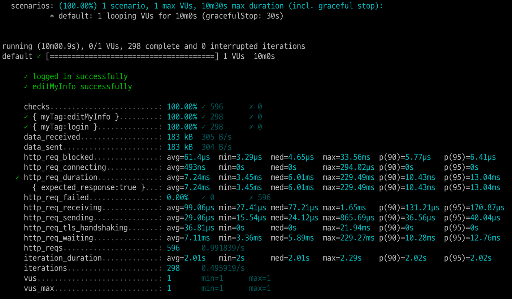
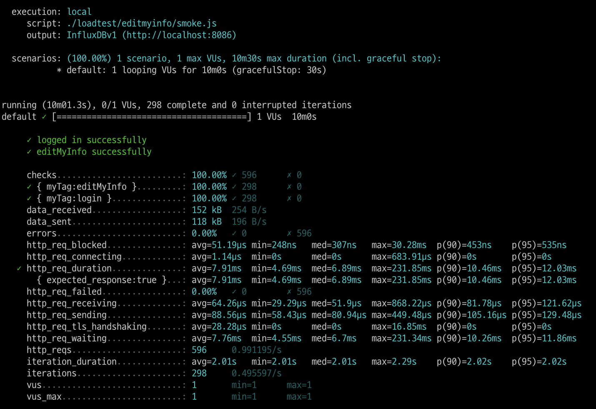
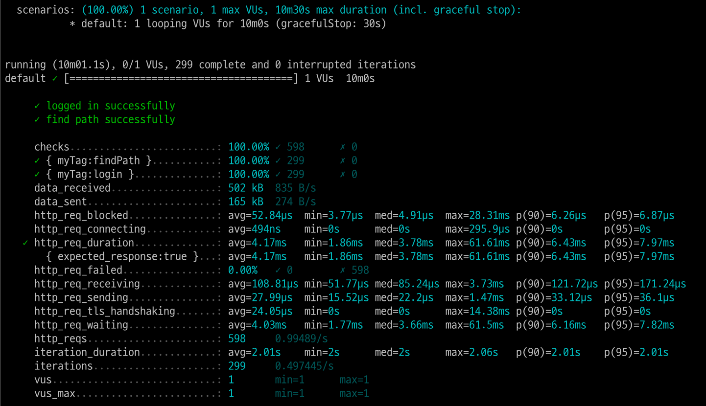
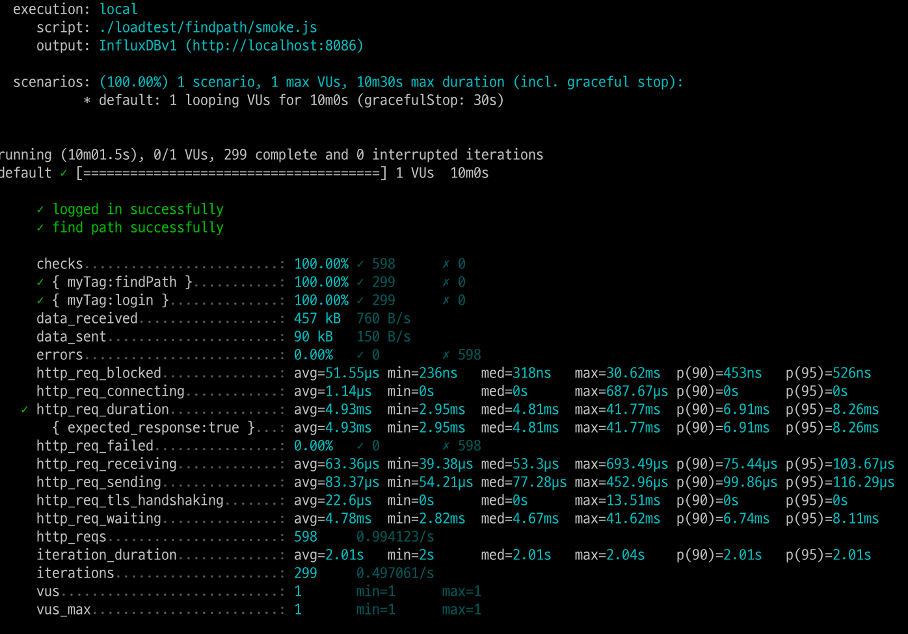
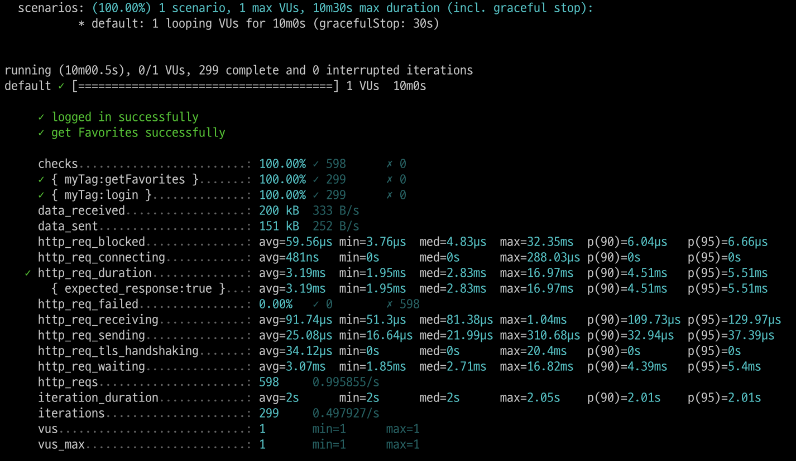
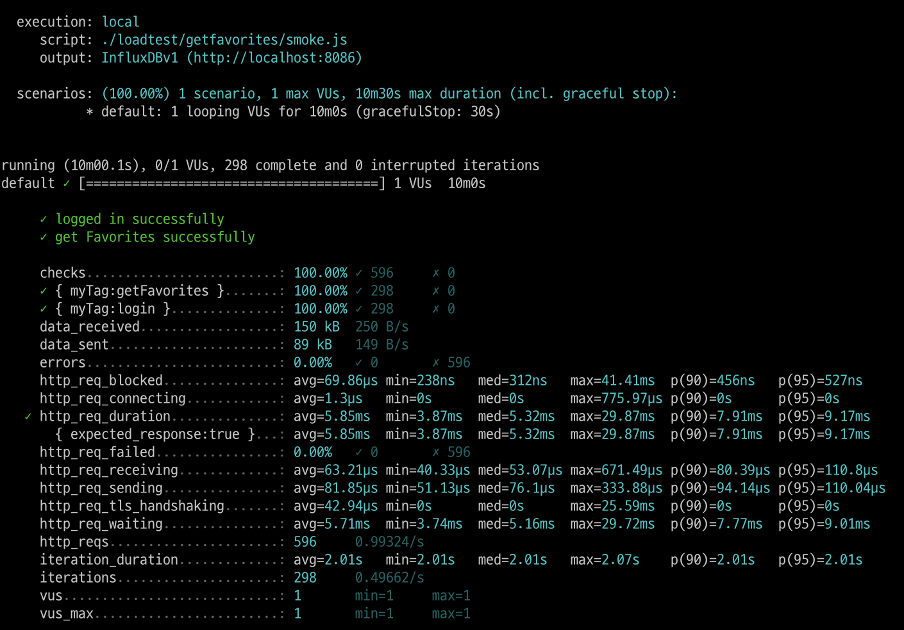
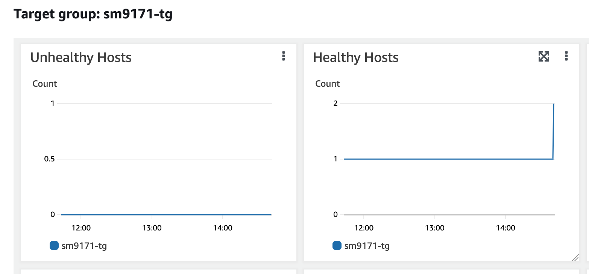
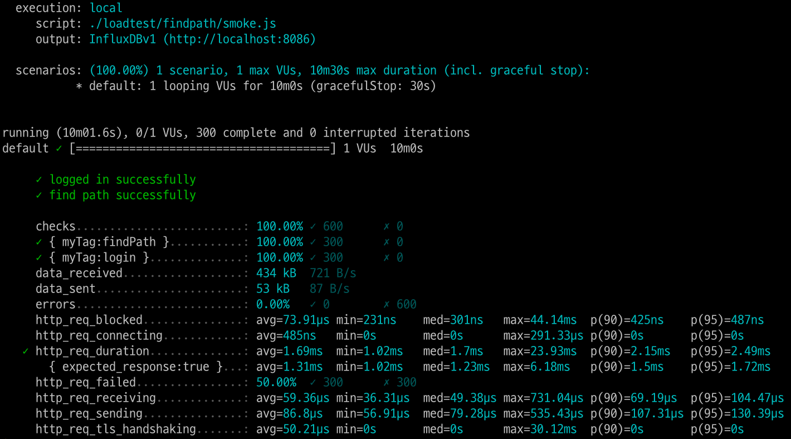
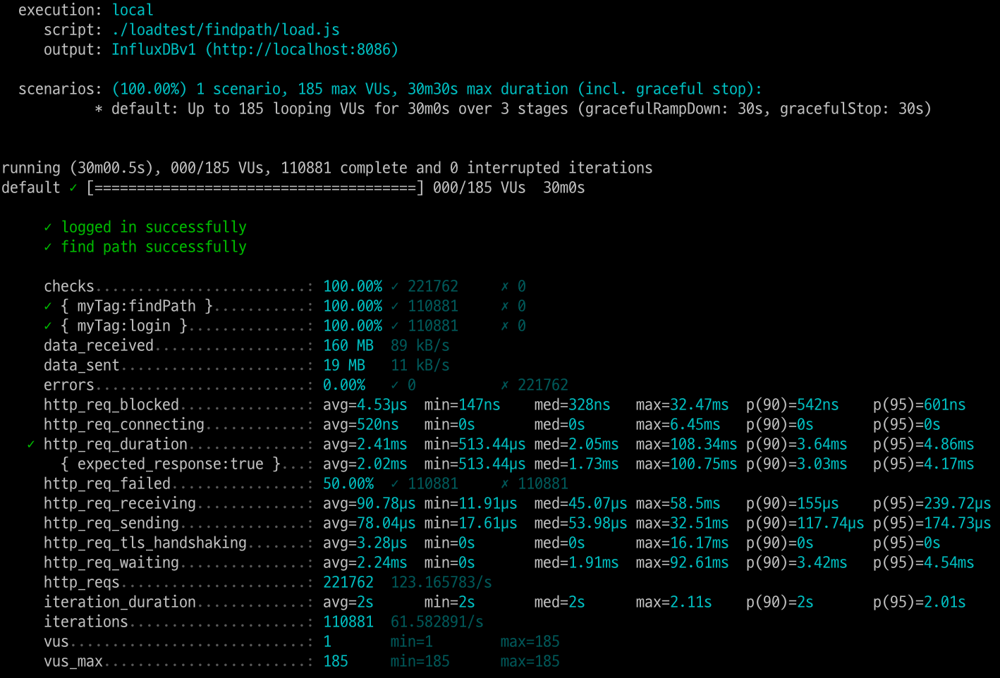
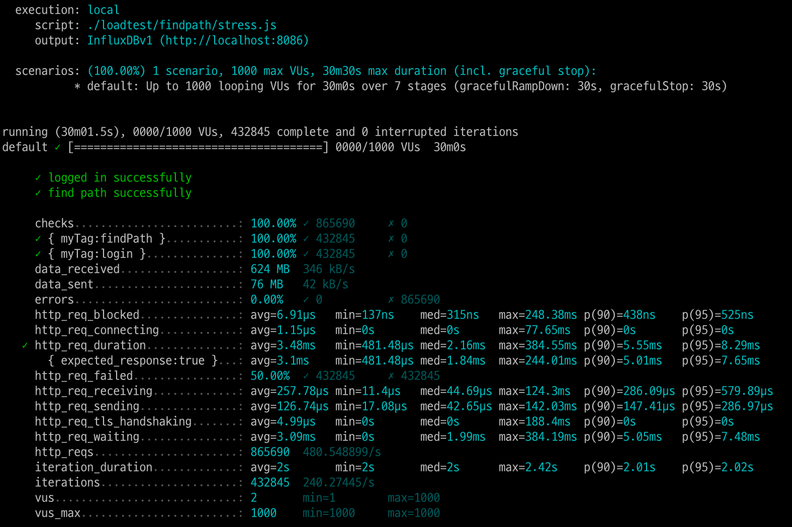

<p align="center">
    
</p>
<p align="center">
  
  
  <a href="https://edu.nextstep.camp/c/R89PYi5H" alt="nextstep atdd">
    
  </a>
  
</p>

<br>

# 인프라공방 샘플 서비스 - 지하철 노선도

<br>

## 🚀 Getting Started

### Install
#### npm 설치
```
cd frontend
npm install
```
> `frontend` 디렉토리에서 수행해야 합니다.

### Usage
#### webpack server 구동
```
npm run dev
```
#### application 구동
```
./gradlew clean build
```
<br>

## 미션

* 미션 진행 후에 아래 질문의 답을 작성하여 PR을 보내주세요.


### 1단계 - 화면 응답 개선하기
1. 성능 개선 결과를 공유해주세요 (Smoke, Load, Stress 테스트 결과)
   1. editmyinfo
      - 개선 전
      
      - 개선 후
      
   2. findpath
      - 개선 전
      
      - 개선 후
      
   3. getfavorites
      - 개선 전
      
      - 개선 후
      
2. 어떤 부분을 개선해보셨나요? 과정을 설명해주세요
   1. Reverse Proxy 개선하기
      1. gzip 압축
      2. cache 설정 적용
      3. http/2 설정
      2. WAS 성능 개선하기
         1. 스프링 캐싱 구현(line,member)
         2. 중복 메서드 제거(findStationById,findById)
---

### 2단계 - 스케일 아웃

1. Launch Template 링크를 공유해주세요.
- https://ap-northeast-2.console.aws.amazon.com/ec2/home?region=ap-northeast-2#LaunchTemplateDetails:launchTemplateId=lt-0fa2c0642a9ea78d4
2. cpu 부하 실행 후 EC2 추가생성 결과를 공유해주세요. (Cloudwatch 캡쳐)
   
```sh
#!/bin/sh

        while true
do

        a=1

done
```

3. 성능 개선 결과를 공유해주세요 (Smoke, Load, Stress 테스트 결과)
- smoke 결과

- load 결과

- stress 결과


---
### [추가] 1단계 - 쿠버네티스로 구성하기
1. 클러스터를 어떻게 구성했는지 알려주세요~ (마스터 노드 : n 대, 워커 노드 n대)

2. 스트레스 테스트 결과를 공유해주세요 (기존에 container 한대 운영시 한계점도 같이 공유해주세요)

3. 현재 워커노드에서 몇대의 컨테이너를 운영중인지 공유해주세요

---

### [추가] 2단계 - 클러스터 운영하기

1. kibana 링크를 알려주세요

2. grafana 링크를 알려주세요

3. 지하철 노선도는 어느정도로 requests를 설정하는게 적절한가요?

4. t3.large로 구성할 경우 Node의 LimitRange, ResourceQuota는 어느정도로 설정하는게 적절한가요?

5. 부하테스트를 고려해볼 때 Pod은 몇대정도로 구성해두는게 좋다고 생각하나요?

6. Spinaker 링크를 알려주세요.
